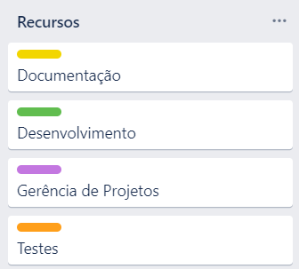

# Gerenciamento de Projeto

> A metodologia contempla as definições ferramentais que serão utilizados pela equipe tanto para a manutenção dos códigos e demais artefatos, quanto para a organização do time na execução das tarefas do projeto.

## Divisão de Papéis

A equipe está organizada da seguinte maneira:

- Scrum Master: Danielle Dias Vieira

- Equipe de Desenvolvimento: 
  Arthur Crossy Mendes; 
  Daniel Vitor de Oliveira Santos; 
  Danielle Dias Vieira; 
  Luiz Fernando Carneiro Rodrigues; 
  Natã Oliveira Sousa; 
  Rodolfo Sousa Lopes. 

- Equipe de Design: 
  Daniel Vitor de Oliveira Santos; 
  Natã Oliveira Sousa. 

## Processo

A equipe utiliza metodologias ágeis, tendo escolhido o Scrumban como base para definição do processo de desenvolvimento. Scrumban (termo cunhado pelo Corey Ladas em 2008), é uma metodologia de desenvolvimento Agile que é um híbrido de Scrum e Kanban. Usa a natureza prescritiva do Scrum para ser Ágil. Usa a melhoria de processo do Kanban para permitir que a equipe melhore continuamente seu processo.

Escolhemos o Scrumban por ter o melhor das metodologias de desenvolvimento Agile, por trabalharmos com o que antecede o desenvolvimento da sprint e com o desenvolvimento da mesma. É um processo que garante o trabalho contínuo e reduz o tempo ocioso dos membros da equipe. Se necessário, pode-se fazer melhorias e revisão da sprint. Todos da equipe trabalham juntos para atingir o objetivo do projeto Diary.

Para organização e distribuição das tarefas do projeto, a equipe está utilizando o Trello estruturado com as seguintes listas:

- `Recursos`: Esta lista contém tarefas que são como legendas das cores de cada cartão e também serão utilizadas para cópia de tarefas, agilizando assim a criação de novos cartões.
- `Backlog`: Todos os artefatos identificados por todo o projeto. Representa o Product Backlog.
- `To Do`: Esta lista é o Sprint atual que estamos trabalhando.
- `Doing`: Quando uma tarefa tiver sido iniciada, ela é movida para esta lista.
- `Test`: Quando as tarefas são concluídas são movidas para esta lista, são testadas e é feito a revisão.`
- `Done`: Nesta lista são colocadas as tarefas concluídas, as que já foram revisadas e estão prontas para serem entregues para o cliente.

O quadro do Kanban do grupo está disponível no Trello, através da URL a seguir:

- Trello: https://trello.com/b/dn1hSkir/projeto-diary

A definição desta estrutura teve como referência a proposta feita por Andrew Littlefield em 2016.

Ela está representada, no estado atual, pela imagem abaixo:

As tarefas seguem o seguinte esquema de cores:
 
 

## Ambientes

Os artefatos do projeto são desenvolvidos a partir de diversas plataformas e a relação dos ambientes com os seus respectivos propósitos são apresentadas na tabela que se segue.

| **Ambiente**                      | **Plataforma**         | **Link de Acesso**                                                                                      |
| --------------------------------- | ---------------------- | ------------------------------------------------------------------------------------------------------- |
| Repositório de código fonte       | GitHub                 | https://github.com/ICEI-PUC-Minas-PMGCC-TI/tiaw-pmg-cc-t-20202-gestao-de-investimentos                  |
| Documentos do projeto             | GitHub                 | https://github.com/ICEI-PUC-Minas-PMGCC-TI/tiaw-pmg-cc-t-20202-gestao-de-investimentos/tree/master/docs |
| Gerenciamento do Projeto          | Trello                 | https://trello.com/b/dn1hSkir/projeto-diary                                                             |
| Projeto de Interface e Wireframes | MarvelApp              | https://marvelapp.com/prototype/25j896dg/section/1150219                                                |
| Editor de código-fonte            | Editor de código-fonte | https://code.visualstudio.com/                                                                          |

Foi escolhido o GitHub para Repositório de código fonte e dos documentos do projeto, pois é uma plataforma que pode ser utilizada por qualquer usuário de forma grátis e porque tem seu controle de versão baseado no Git. Ela também é uma plataforma que alguns membros da equipe já tinham familiaridade para trabalhar. E como são 6 contribuidores ao mesmo tempo, com o GitHub e o Git, é possível várias pessoas trabalhando em suas tarefas, tendo menos risco de conflitos no código.

Foi escolhido o aplicativo Trello para gerenciar as tarefas do projeto, pois também é grátis e tem cartões com as tarefas de forma intuitiva. É uma ferramenta que se pode utilizar com facilidade.

Foi escolhido o aplicativo MarvelApp, pois para criar o design e Wireframe não é necessário nenhum código, é possível realizar designs interativos de forma intuitiva e também é grátis a plataforma.

Foi escolhido o editor de código fonte Visual Studio Code, pois ele tem controle de Git já incorporado, é possível instalar várias extensões de linguagens, edição de temas e idiomas, conectar serviços adicionais, entre outros. Todos da equipe já utilizam este software facilitando o trabalho e a interação de todos.

É utilizado também as redes sociais Whatsapp e Microsoft Teams para a comunicação da equipe, pois são aplicativos que toda a equipe já conhece e tem facilidade no uso do dia a dia.

As ferramentas utilizadas para construir os diagramas foi o Miro e o Dia (GNOME), porque os membros já conheciam estes softwares, são intuitivos e gratuitos.
